# 深入ES Module, 浅析原理
下面简称ES Module为esm
<!-- TOC -->

- [深入ES Module, 浅析原理](#深入es-module-浅析原理)
  - [ES6 模块生成的全过程如下（自己多拆除两个过程）：](#es6-模块生成的全过程如下自己多拆除两个过程)
    - [是谁去找到，并且下载所有文件的呢？](#是谁去找到并且下载所有文件的呢)
    - [关于文件被解析为 module records：](#关于文件被解析为-module-records)
    - [模块的实例化，以及怎么把所有模块实例链接起来呢？](#模块的实例化以及怎么把所有模块实例链接起来呢)
    - [怎么进行求值的呢？](#怎么进行求值的呢)
    - [esm模块化下载，实例化，求值 与 commonJs模块化下载，实例化，求值之间有什么区别呢？](#esm模块化下载实例化求值-与-commonjs模块化下载实例化求值之间有什么区别呢)
- [细节提问](#细节提问)
- [参考：](#参考)
- [社交信息 / Social Links:](#社交信息--social-links)
  - [(Welcome to pay attention, 欢迎关注)](#welcome-to-pay-attention-欢迎关注)

<!-- /TOC -->

## ES6 模块生成的全过程如下（自己多拆除两个过程）：
- loading（下载）- loader 找到，并且下载所有模块文件。
- Construction（构造）- 解析模块文件为module records。
- Instantiation（实例化）- 在内存里找到所有的“盒子”（内存空间），把所有导出的变量放进去（但是暂时还不求值）。
- linking（链接） -  让导出(export)和导入(import)都指向内存里面的这些盒子，这叫做“linking(链接)”。
- Evaluation（求值）- 执行代码，得到变量的值然后放到这些内存的“盒子”里。  
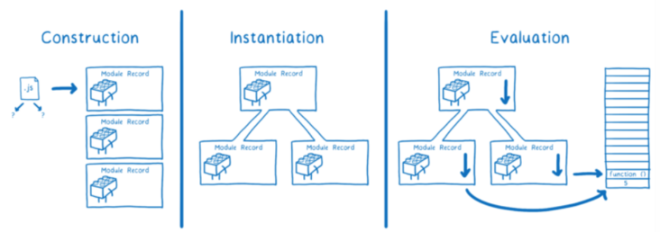

那么接下来，我们需要提问，将整个过程刨析一下：
1. 是谁去找到，并且下载所有文件的呢？
2. 关于文件被解析为 module records
3. 模块的实例化，以及怎么把所有模块实例链接起来呢？
4. 怎么进行求值的呢？
5. esm模块化下载，实例化，求值 与 commonJs模块化下载，实例化，求值之间有什么区别呢？（留坑）

 
### 是谁去找到，并且下载所有文件的呢？   
是loader（下载器）去获取并且下载文件。

对于loader而言，不同的规范有不同loader的。对于浏览器来说，这个规范是HTML规范。  
你可以根据你所使用的平台来得到不同的loader。  
loader也控制着模块如何加载, 它会调用ES module的方法--ParseModule, Module.Instantiate,和Module.Evaluate。  
  loader就像傀儡师，操纵着JS引擎的线。

而 ES module规范陈述了你应该怎样把文件解析为module records，和怎样初始化模块以及求值。  

好了，我们现在知道，是loader去寻找文件，并且下载文件的，那么，loader是怎么去寻找所有的依赖文件呢？

首先，loader需要找到入口文件，在HTML文件里，我们通过使用script标签告诉loader哪里去找到入口文件。  
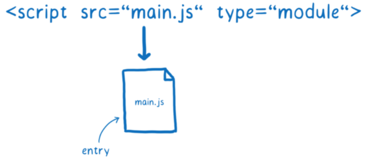

接下来，loader通过import语句的某一部分又被叫做“模块说明符”，它告诉loader在哪儿可以找到下一个模块。
在浏览器中，浏览器会根据”模块说明符“（就是一个URL）去下载模块文件。  
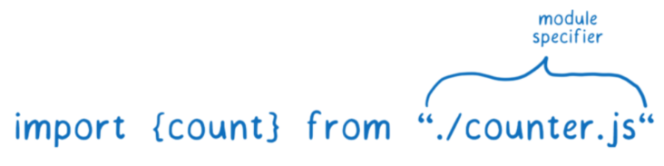

当loader通过一个URL去获取文件的时候，它会把这个URL放入module map并且做上“正在获取”的标志。然后它发出请求，进而继续下一个文件的获取工作。

当别的模块也依赖同一个文件的时候，会发生什么呢？  
Loader会查询module map里面的每一个URL，如果它看到这个URL有“正在获取“的标志，那它就不管了，继续下一个URL的处理。

module map不只是看哪个文件正在被下载，它同时也管理这模块的缓存。

###  关于文件被解析为 module records：  
获取到文件之后，浏览器是使用不了这些文件。所有的文件都必须要转变为一系列被叫做“Module Records（模块记录）的数据结构，这样浏览器才能明白这些文件的内容，这有助于浏览器理解模块的不同之处是什么。  
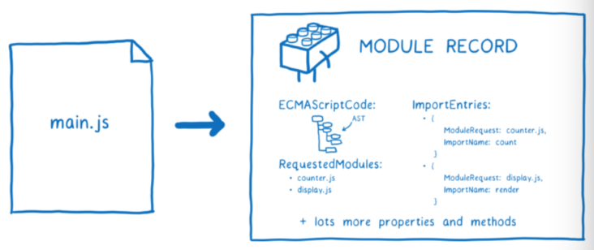

一旦module record创建完成，它就会被放到module map里面去。这意味着无论何时被请求，loader都可以从module map里面提取它。  
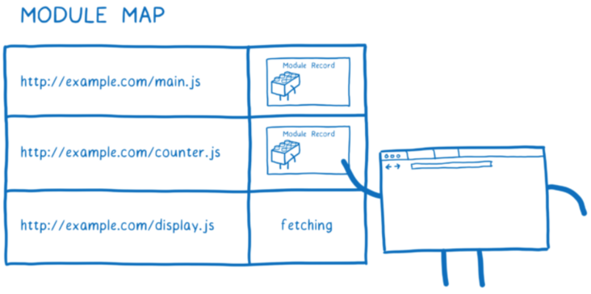

这一步骤就结束了。在加载进程结束之后，我们就从拥有一个入口文件到最后拥有一系列的module record。  
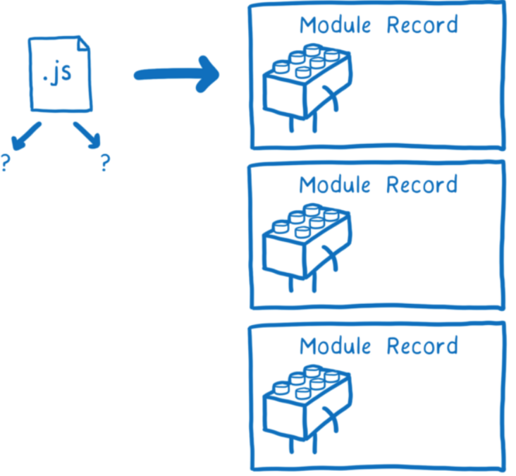

### 模块的实例化，以及怎么把所有模块实例链接起来呢？

本质上， 实例化这一步就是关于怎样把 module record 链接到内存里面。

首先，JS引擎会创建了一个“模块环境记录（module environment record）”。  
这个模块环境记录管理着module record的变量，然后它在内存里面找到所有导出（export）的变量的“盒子(内存地址)。  
module environment record会一直监控着内存里面的哪个盒子和哪个export是相关联的。  
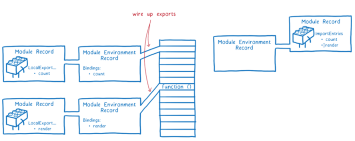

在这个时候，这些内存里面的盒子还没有获得它们的值，只有在求值这一步骤完成之后，真正的值才会被填充进去。

为了实例化模块图（module graph），JS引擎会做一个所谓**深度优先后序遍历**的操作。意思就是说，**JS引擎会先走到模块图的最底层 -- 找到不依赖任何其他模块的那些模块，并且设置好它们的导出（export）。**

**当JS引擎完成一个模块的所有导出的链接，它就会返回上一个层级去设置来自于这个模块的导入（import）。**  
需要注意的是，导出和导入都是指向同一片内存地址。  
**先链接导出保证了所有的导入都能找到对应的导出。**  
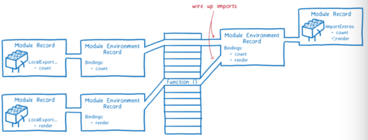

ES module使用所谓的“实时绑定”，导出的模块和导入的模块都指向同一段内存地址。

在这一步的最后，我们使得所有的模块实例导出/导入的变量的内存地址链接起来了。

### 怎么进行求值的呢？
最后一步是把值都填入内存地址中。  
JS引擎通过执行最上层的代码-也就是function以外的代码，来实现这一目的。  
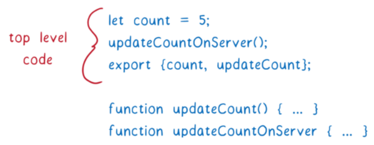

和实例化一样，求值也是按照深度优先倒序的规则来的。

### esm模块化下载，实例化，求值 与 commonJs模块化下载，实例化，求值之间有什么区别呢？
浏览器会根据URL下载模块文件。但是，对于整个依赖图来说，在同一时间下载是不可能的。因为直到解析了这个文件，你才知道这个模块需要哪些依赖。  
但是，你又不能提前解析这个文件除非你已经获取了它。  
这意味着，如果esm要解析一个文件，我们必须一层一层地遍历这颗依赖树，理清楚他所有的依赖，然后找到并且下载这些依赖。  
但是，假如主线程一直在等待这些文件下载，那么大量的其他的任务就被卡在队列里面。(下载 - 解析 - 下载 - 解析...)
这是因为，在浏览器里面进行下载工作，会耗费大量的时间。(而且这个下载的动作不能是异步的，必须是同步的)  
像这样阻塞主线程，会导致使用了模块的app太慢了。  
这也是ES module规范把算法分割成多个步骤的其中一个原因。把construction（构建）单独划分到一个步骤，**这就允许浏览器可以在进入到instantiating（实例化）的一系列同步工作之前，可以先获取模块文件并且建立模块之间的依赖树。**

CommonJS可以做不同于ES Module的处理，是因为从文件系统里面加载文件比从网络上下载文件要花少得多的时间。（直接从磁盘读取文件比网络请求快）  
这就意味着，Node可以在加载文件的时候阻塞主线程。又因为文件已经加载好了，那么实例化和求值（这两步在CommomJS里面是没有分开的）也显得很有道理。  
这意味着，在你返回这个模块之前，其依赖树上所有的依赖都完成了loading(加载)，instantiating(实例化)和evaluating（求值）。  

对比之动态导入：
- Node里面的CommomJS module， 你可以在模块说明符里面使用变量。在你寻找下一个模块之前，你会执行完本模块的所有代码。这就意味着当你去做模块识别的时候，这个变量已经有值了。
- 在ES Module里面，你是在任何求值之前先建立了完整的依赖树。这说明，你不能在模块说明符里面使用变量，因为这个变量目前还没有值。

那么，esm中就不能进行模块的动态导入了吗？  
不是的，有一个提议叫做动态导入，可以用来满足类似这样的需求：
> import(${path}/foo.js).  

动态导入的工作原理是，任何使用import()来导入的文件，都会作为一个入口文件从而创建一棵单独的依赖树，被单独处理。  
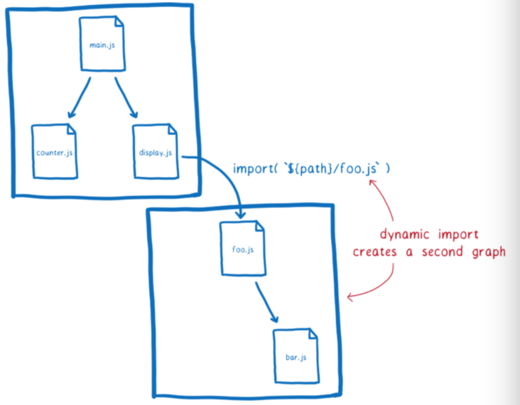  
但有一点需要注意的是 - 任何同时存在于两棵依赖树的模块都指向同一个模块实例。这是因为loader把模块实例缓存起来了。

对比之模块的内存引用：
- esm模块导出和导入都是指向同一片内存地址，这样就使得导入和导出形成了一种“实时绑定”。  
“实时绑定”的好处是，不需要跑任何的代码，就可以链接起所有的模块。这有助于当存在循环依赖情况下的求值。
- commonJs模块导入的值是基于导出拷贝的（如图：）  
  

# 细节提问
- loader是怎么判断入口文件的呢？
- loader怎么判断某个文件是不是一个模块呢？  
在浏览器里面，这十分简单。你只需要给 script标签 加一个type="module"。这就告诉了浏览器这个文件需要被当成是一个模块来解析。因为只有模块才可以被导入，所以浏览器知道导入的文件也是模块。
但是Node不使用HTML相关的标签，所以无法使用type来表示。而在Node里面是通过文件的扩展名".mjs"来表明这是一个ES Module的。
不管是哪种方式，最终都是loader来决定这个文件是否当作一个模块来解析。假如它是一个module或者有import，那就会开始这个进程，直到所有的文件被下载和解析。

- loader怎么去查找、下载所有的模块文件的呢？  
浏览器或者Node的loader就沿着每一条"import"语句找到下面依赖的代码文件。  
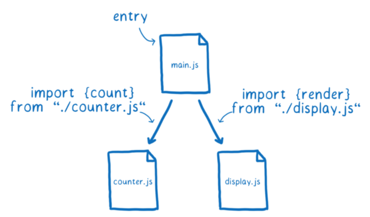

- 为什么被loader加载回来的模块文件，浏览器是不能直接使用的呢？为什么需要把这些模块文件转变为module record呢？ （暂时没有找到答案）

- module record里面有什么东西呢？（暂时没有找到答案）

  

# 参考：
- [ES module工作原理](https://segmentfault.com/a/1190000020388889)
- [ES modules: A cartoon deep-dive](https://hacks.mozilla.org/2018/03/es-modules-a-cartoon-deep-dive/)

# 社交信息 / Social Links:
 ## (Welcome to pay attention, 欢迎关注)
Github：
[@huangyangquang](https://github.com/huangyangquang) | [最新技术追踪](https://github.com/huangyangquang/Latest-technology-tracking) | [javascript版算法](https://github.com/huangyangquang/Algorithm) | [早期前端知识总结 + 案例](https://github.com/huangyangquang/DEMO) | 欢迎Star✨✨✨

Social：
[新浪微博](https://weibo.com/u/6385661354) | [知乎](https://www.zhihu.com/people/cclv3) | [掘金](https://juejin.cn/user/2735240661699181) | [思否](https://segmentfault.com/u/c_z7wgq/articles) 

E-mail： fengquan.h@qq.com  

Old Blog：[CSDN](https://blog.csdn.net/huangyangquan3?type=blog)

微信公众号：前端学长Joshua  

 

