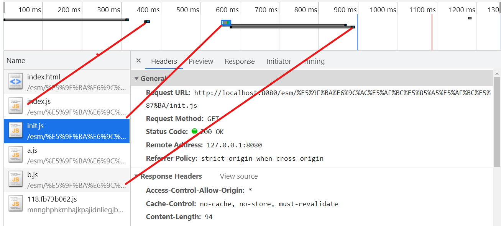
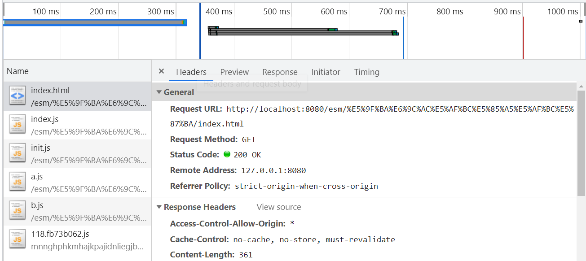

# 翻译篇 - ES 模块预加载和完整性


<!-- TOC -->

- [翻译篇 - ES 模块预加载和完整性](#翻译篇---es-模块预加载和完整性)
  - [生产环境中模块的优化](#生产环境中模块的优化)
  - [模块预加载](#模块预加载)
  - [模块预加载例子：](#模块预加载例子)
  - [Polyfilling 模块预加载](#polyfilling-模块预加载)
  - [完整性限制](#完整性限制)
  - [号召一起行动](#号召一起行动)
  - [JSPM Generator - 模块预加载生成器](#jspm-generator---模块预加载生成器)
- [参考](#参考)
- [社交信息 / Social Links:](#社交信息--social-links)
  - [(Welcome to pay attention, 欢迎关注)](#welcome-to-pay-attention-欢迎关注)

<!-- /TOC -->


## 生产环境中模块的优化

当在生产环境中使用ES模块时，目前有两种主要的性能优化要应用-代码拆分和预加载。

代码拆分优化可用于打包器（如 esbuild 或 RollupJS）中的原生 ES 模块。代码拆分确保对于任何两个总是被一起加载的模块，它们将始终被内联到同一个模块文件中，作为网络优化的块模块（或者甚至在可能的情况下，会被内联到入口模块本身中）。

然后预加载解决了模块依赖图中模块按引用顺序加载的问题 - 模块仅在静态导入图中的每个模块都加载后才执行，模块仅在其父模块加载后才加载。参考：[实操探究之ESM引入顶级await前后模块的执行顺序](https://github.com/huangyangquang/Latest-technology-tracking/blob/main/ECMAScript/ES%20Module%E5%8E%9F%E7%90%86/%E5%AE%9E%E6%93%8D%E6%8E%A2%E7%A9%B6%E4%B9%8BESM%E5%BC%95%E5%85%A5%E9%A1%B6%E7%BA%A7await%E5%89%8D%E5%90%8E%E6%A8%A1%E5%9D%97%E7%9A%84%E6%89%A7%E8%A1%8C%E9%A1%BA%E5%BA%8F.md)

## 模块预加载

ES 模块的预加载在浏览器中如下写法：
```
<link rel="modulepreload" href="..."/> 
```

当它首次在 Chrome 中发布时，[Google Developers 2017](https://developers.google.com/web/updates/2017/12/modulepreload) 更新中有一篇关于它的精彩文章。

> 建议尽可能为所有深度依赖项注入 modulepreload 标签，以便完全消除模块加载的延迟成本，这同时也是是静态预加载的主要好处。

【使用 modulepreload 的另一个主要好处是，它是目前使用“integrity”属性支持所有加载模块完全完整性的唯一机制。】（不太明白,等我查找资料）

比如app.js加载dependency.js加载library.js，我们可以这样写：
```
<link rel="modulepreload" href="/src/app.js" integrity="sha384-Oe38ELlp8iio2hRyQiz2P4Drqc+ztA7jb7lONj7H3Cq+W88bloPxoZzuk6bHBHZv"/>

<link rel="modulepreload" href="/src/dependency.js" integrity="sha384-kjKb2aJJUT956WSU7Z0EF9DZyHy9gdvPOvIWbcEGATXKYxJfkEVOcuP1q20GT2LO"/>

<link rel="modulepreload" href="/src/library.js" integrity="sha384-Fwh0dF5ROSVrdd/vJOvq0pT4R6RLZOOvf6k+ijkAyUtwCP7B0E3qHy8wbot/ivfO"/>

<script type="module" src="/src/app.js"></script>
```

由于预加载导致 app.js、dependency.js 和 library.js 现在立即并行加载，因此模块延迟加载被消除，【并且通过所有脚本的完整性，我们可以完全保护模块执行环境。】（不太明白,等我查找资料）

## 模块预加载例子：
代码：  
index.html:
```
<!DOCTYPE html>
<html lang="en">
<head>
	<meta charset="UTF-8">
	<title>Document</title>
	<!-- <link rel="modulepreload" href="./index.js"/>
	<link rel="modulepreload" href="./init.js"/>
    <link rel="modulepreload" href="./a.js"/>
	<link rel="modulepreload" href="./b.js"/> -->
</head>
<body>
	<script src="./index.js" type="module"></script>
</body>
</html>
```

index.js:
```
import './init.js'
import {a, Person, obj, b} from './a.js'

console.log(a, Person, obj, b)


console.log('index')
```

init.js:
```
import './b.js'

console.log('init')

export let str = 'init'

const a = 1

export {a}
```

a.js:
```
import * as bb from "./b.js"

console.log('b:', bb)

export let a = 1

export function Person() {

}

export const obj = {
	name: "sss"
}

let b = 1

export {b}
```

b.js:
```
export let a = 1

export function Person() {

}

export const obj = {
	name: "sss"
}

let b = 1

export {b}

console.log('b')
```

未使用模块预加载：  
模块是串行加载的，按模块的解析顺序进行加载  


使用模块预加载：（去掉index.html代码注释）  
所有模块是并行加载的（加载时间被明显缩短200ms）


但是，如果项目的模块很多的话，那么这样一个一个手动加，也不是好办法，所以最好是可以先获取到整个模块依赖图，然后通过脚本将模块预加载的标签自动加入到页面上。

但是，话又说回来，如果可以获取到整个模块依赖图的话，那么整个模块依赖就已经开始在加载了。参考[深入ES Module, 浅析原理](https://github.com/huangyangquang/Latest-technology-tracking/blob/main/ECMAScript/ES%20Module%E5%8E%9F%E7%90%86/%E6%B7%B1%E5%85%A5ES%20Module%2C%20%E6%B5%85%E6%9E%90%E5%8E%9F%E7%90%86.md)

## Polyfilling 模块预加载

此功能的一个问题是它目前仅在 Chromium 浏览器中实现，但可以使用以下代码构建 polyfill：
```
<script>
  function processPreload () {
    const fetchOpts = {};
    if (script.integrity)
      fetchOpts.integrity = script.integrity;
    if (script.referrerpolicy)
      fetchOpts.referrerPolicy = script.referrerpolicy;
    if (script.crossorigin === 'use-credentials')
      fetchOpts.credentials = 'include';
    else if (script.crossorigin === 'anonymous')
      fetchOpts.credentials = 'omit';
    else
      fetchOpts.credentials = 'same-origin';
    fetch(link.href, fetchOpts);
  }
  for (const link of document.querySelectorAll('link[rel=modulepreload]'))
    processPreload(link);
</script>
```

此外，如果我们想为这个 polyfill 添加动态预加载支持，那么我们可以使用突变观察者：
```
new MutationObserver(mutations => {
  for (const mutation of mutations) {
    if (mutation.type !== 'childList') continue;
    for (const node of mutation.addedNodes) {
      if (node.tagName === 'LINK' && node.rel === 'modulepreload')
        processPreload(node);
    }
  }
}).observe(document, { childList: true, subtree: true });
```

【这不会填充深度依赖预加载，但涵盖了大多数用例，并通过启动内部完整性映射在所有模块浏览器中启用“完整性”检查。】（不太明白,等我查找资料）

通过这种方式，我们可以在所有浏览器的生产模块环境中获得完整的预加载和完整性支持。

上面的 polyfill 包含在 [ES Module Shims](https://github.com/guybedford/es-module-shims) 的最新 0.12.1 版本中，它为各种 ES 模块功能提供了 polyfill 的组合，特别是对于导入地图。

## 完整性限制

使用 modulepreload 作为主要完整性方法存在一个主要问题是：没有一个简单的方法，可以在不立即执行预加载的情况下，为延迟加载的模块预先提供完整性。对于现在的生产工作方式，最好的方法是构建一个自定义的动态导入包装器，在触发动态导入之前延迟注入预加载。

尽管采用这样办法，这项工作的工作量也不小，而且可能会带来比较大的处突，如果有人采用这样的方法，我会感到惊讶。然而，模块完整性是使用 ES 模块 CDN 的绝对关键特性。

在未来，可能与模块预加载 和 完整性相关的规范包括：
- Import assertions：已建议使用 import 'mod' assert {integrity: '...' } 语法，但尚未为 import assertions 进行规定或实现。
  
  不幸的是，此功能存在以下问题：它取消了导入映射的主要性能优势，即允许图形中的所有模块有更长失效时间可以独立缓存。因此，虽然它对某些特定情况很有用，但作为这个问题的一般解决方案，它会倒退一步。

- Import Map Integrity：我已经为导入地图建议了一个完整性属性规范，允许它们在这里充当编排点。 这里的困难是从浏览器中获得支持，但到目前为止还没有成功。
- Milestones： 这是一个实验性的性能方法，使用当前的 Proposal Doc 和 Chrome CL，旨在允许指定一些关于脚本加载条件的信息，以便进行更细粒度的加载优化。不幸的是，目前没有计划为预加载支持此功能，因此这意味着它无法以当前形式解决延迟模块加载的深度图内容完整性问题。
- Lazy Preloads：另一种设计可能是在预加载标签上有一个属性来指示它不应被预加载，但其完整性值仍应适用。 我在 WebAppSec 上提出了这个建议，但这里的预加载和完整性的组合似乎有些混乱。
- Web Bundles： 从常见问题解答中，似乎 Web Bundle 的当前完整性状态由于哈希验证的高带宽成本而被视为后续提案。
  
也许通用模块完整性的概念可以折叠成一个集中的 Web 完整性清单，可能与安全清单中的其他权限/安全功能相结合。相反，验证可以从我们用于优化完整性的广泛方法中受益，包括针对分块边界优化的默克尔树，甚至更奇特的东西。
## 号召一起行动
上网的人应该能够访问互联网上的网站，并且所有执行的代码都经过完整性哈希验证，这一基本原则是一项绝对基本的安全属性。

以最佳方式完成这项工作需要一些新的工作，我们需要积极与浏览器供应商和标准机构合作，以确保可以为未来的 Web 平台完全轻松地启用此安全属性，而不会出现摩擦。

## JSPM Generator - 模块预加载生成器
JSPM Generator 是我一直致力于针对模块 CDN 或本地包路径生成导入映射的低级工具。最新版本现在包括对模块依赖项的静态跟踪的支持，允许为模块图构建这些预加载标签。 改进这些生成器 API 和工作流程的工作正在进行中。

通过切换应用程序右上角的“预加载”和“完整性”框，JSPM.io 的在线生成器也包含对这些功能的支持。

这是实际操作的演示，为单独的 CDN 依赖项切换预加载：


# 参考
- [ES Module Preloading & Integrity](https://guybedford.com/es-module-preloading-integrity?utm_source=ESnextNews.com&utm_medium=Weekly+Newsletter&utm_campaign=2021-07-06)

# 社交信息 / Social Links:
 ## (Welcome to pay attention, 欢迎关注)
Github：
[@huangyangquang](https://github.com/huangyangquang) | [最新技术追踪](https://github.com/huangyangquang/Latest-technology-tracking) | [javascript版算法](https://github.com/huangyangquang/Algorithm) | [早期前端知识总结 + 案例](https://github.com/huangyangquang/DEMO) | 欢迎Star✨✨✨


Social：
[新浪微博](https://weibo.com/u/6385661354) | [知乎](https://www.zhihu.com/people/cclv3) | [掘金](https://juejin.cn/user/2735240661699181) | [思否](https://segmentfault.com/u/c_z7wgq/articles) 

E-mail： fengquan.h@qq.com  

Old Blog：[CSDN](https://blog.csdn.net/huangyangquan3?type=blog)

微信公众号：前端学长Joshua  

