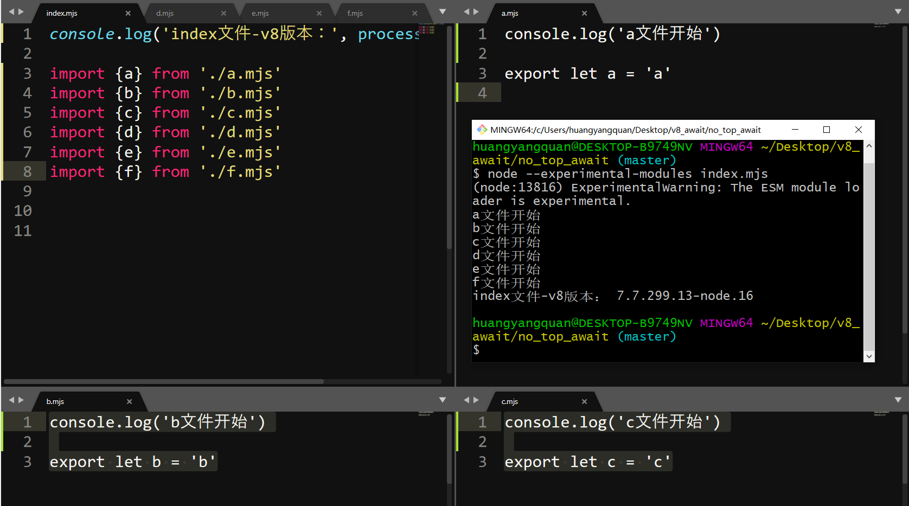
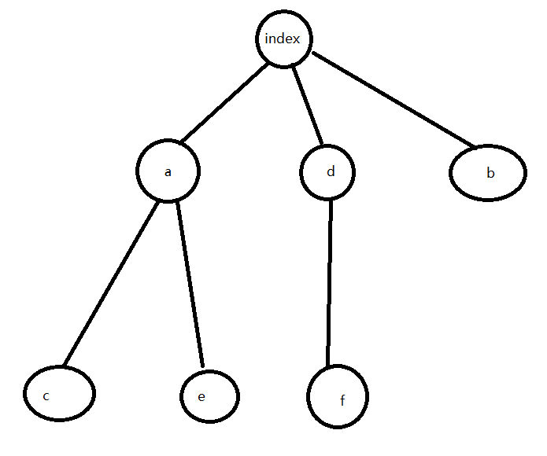
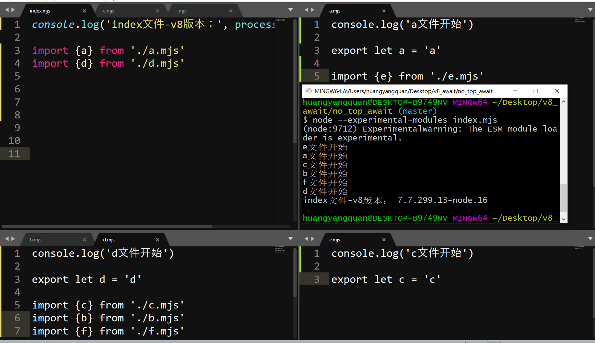
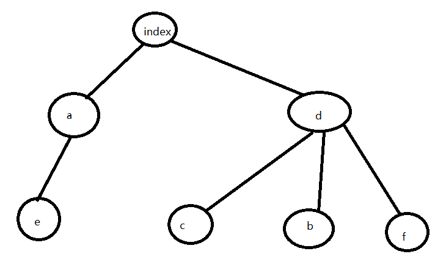
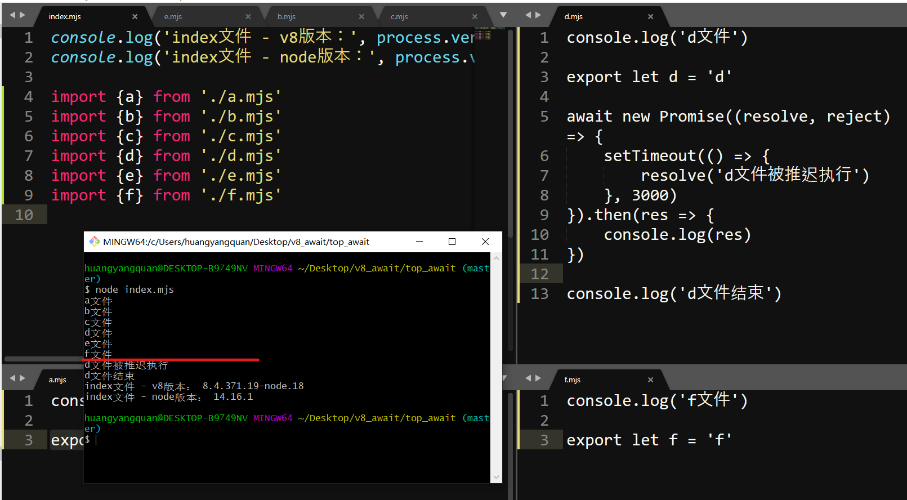
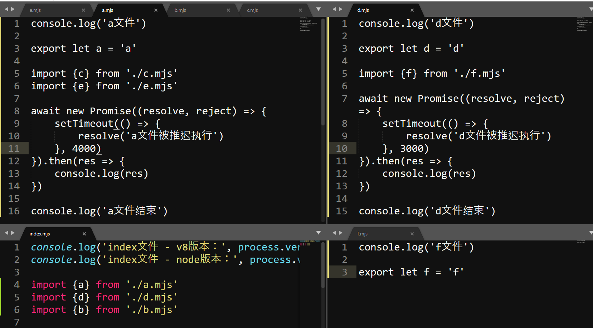
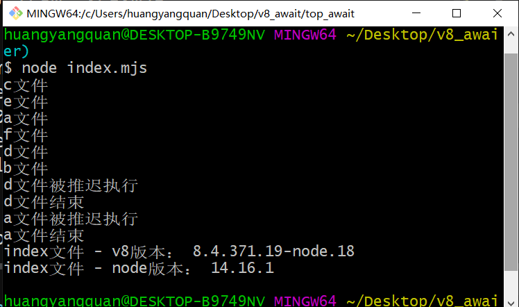
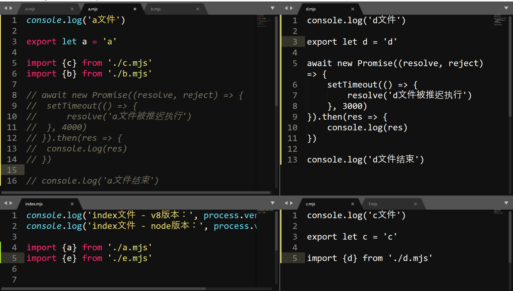
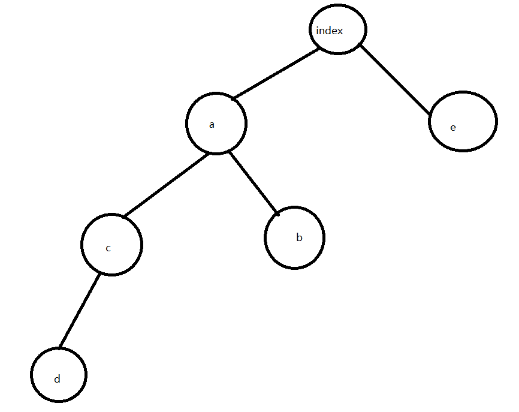
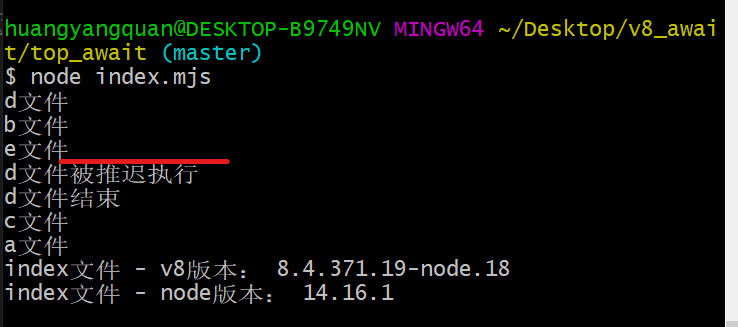

# 实操探究之ESM引入顶级await前后模块的执行顺序

请先阅读[Top-level await](https://v8.dev/features/top-level-await)或者[V8 9.1 正式支持顶层 await !](https://juejin.cn/news/6968635331151134757)

经过阅读，我们知道，在引入顶级await之前，esm模块的执行顺序是按**后续遍历**来的，原文是这样说的：
> The JavaScript engine executes modules in post-order traversal: starting from the left-most subtree of your module graph, modules are evaluated, their bindings are exported, and their siblings are executed, followed by their parents. 

翻译：
> js引擎按照后续遍历执行模块，先执行模块图的最左边子树，然后把模块的绑定给导出，然后在执其他的兄弟节点，最后才是它的父节点。

例子如下： 

     

如上图：index文件导入了a,b,c,d,e,f文件，a,b,c,d,e,f文件内容与a文件相同。  
通过打印结果，我们知道，是先从最左边的子节点开始执行，然后在执行其他的兄弟节点，最后在执行父级节点的。  

看下一个例子：  

如上图：  
index文件导入了a,d,b文件；
a文件导入了c,e文件；
d文件导入了f文件。

我们可以得出依赖图如下：  

所以，按照后续遍历执行顺序是：c,e,a,f,d,b,index  
我们看下执行结果，也是符合的。

在看下一个案例：  

依赖图如下：  

所以，按照后续遍历执行顺序是：e,a,c,b,f,d,index  
我们看下执行结果，也是符合的。

而在引入顶层await之后呢？执行规则实际上是有发生变化的，  
以下是在模块中使用顶级 await 时发生的情况：  
1. 当前模块的执行被推迟，直到Promise被resolved。
2. 父模块的执行被推迟到调用 await 的子模块及其所有兄弟模块导出(export)绑定。
3. 兄弟模块和父模块的兄弟模块能够以相同的同步顺序继续执行 —— 假设模块图中没有循环或其他等待的承诺。
4. 调用 await 的模块在等待Promise被resolves后恢复执行。
5. 只要没有其他等待的Promise，父模块和后续树就会继续以同步顺序执行。

那么，下面我们来一探究竟吧：  

如上图：index文件导入了a,b,c,d,e,f文件;  
a,b,c,,e,f文件内容与f文件相同;  
d文件内容如图: 会延迟3000ms后触发resolve函数（实际上就会阻塞d文件的执行）  
我们看下执行结果（参照使用顶级 await 时发生的情况）：  
> 注意：在红线部分，会延迟3000ms之后，然后打印出后续的内容

所以，我们可以得出结论：
1. 当前模块的执行被推迟，直到Promise被resolved。
2. 父模块的执行被推迟到调用 await 的子模块及其所有兄弟模块导出(export)绑定。
3. 当前模块的await, 不会影响其他兄弟模块的执行

在看下另外一个例子：  

依赖图如下：  

执行结果如下：  

我们可以得出结论：  
实际上，引入顶层await是不会阻塞兄弟节点的执行和父元素的兄弟节点的执行。  
因为，a,d文件实际上是会阻塞自己模块的执行的，但是b文件没有被阻塞，所以可以得出该结论。
其次是，父模块的执行被推迟到调用 await 的子模块及其所有兄弟模块导出(export)绑定。  
显而易见，index文件作为a,d文件得父级节点，因为a,d文件阻塞，导致index文件最后执行。

在看下一个例子： 
d文件使用了顶层await,其他都没有使用，那么e文件会被阻塞吗？ 

依赖图：  

执行结果：  

看执行结果，e文件不会被阻塞的，阻塞的是d文件，c文件，a文件，index文件。  
因为 兄弟模块和父模块的兄弟模块能够以相同的同步顺序继续执行 —— 假设模块图中没有循环或其他等待的承诺。  
e文件作为a文件的兄弟模块，a文件虽然会因为d文件调用了顶层await而被阻塞执行，但是作为父级模块的兄弟模块的e文件而已，他是不会被阻塞执行的。

# 参考：
- [Module execution order](https://v8.dev/features/top-level-await#module-execution-order)

# 社交信息 / Social Links:
 ## (Welcome to pay attention, 欢迎关注)
Github：
[@huangyangquang](https://github.com/huangyangquang) | [最新技术追踪](https://github.com/huangyangquang/Latest-technology-tracking) | [javascript版算法](https://github.com/huangyangquang/Algorithm) | [早期前端知识总结 + 案例](https://github.com/huangyangquang/DEMO) | 欢迎Star✨✨✨

Social：
[新浪微博](https://weibo.com/u/6385661354) | [知乎](https://www.zhihu.com/people/cclv3) | [掘金](https://juejin.cn/user/2735240661699181) | [思否](https://segmentfault.com/u/c_z7wgq/articles) 

E-mail： fengquan.h@qq.com  

Old Blog：[CSDN](https://blog.csdn.net/huangyangquan3?type=blog)

微信公众号：前端学长Joshua  

 