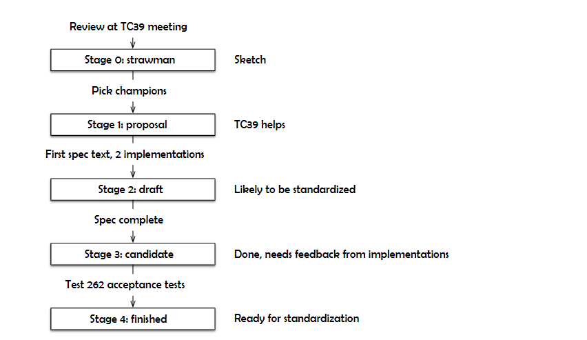
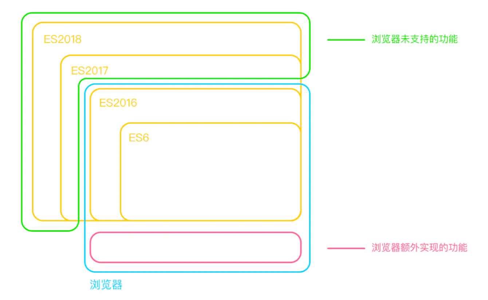
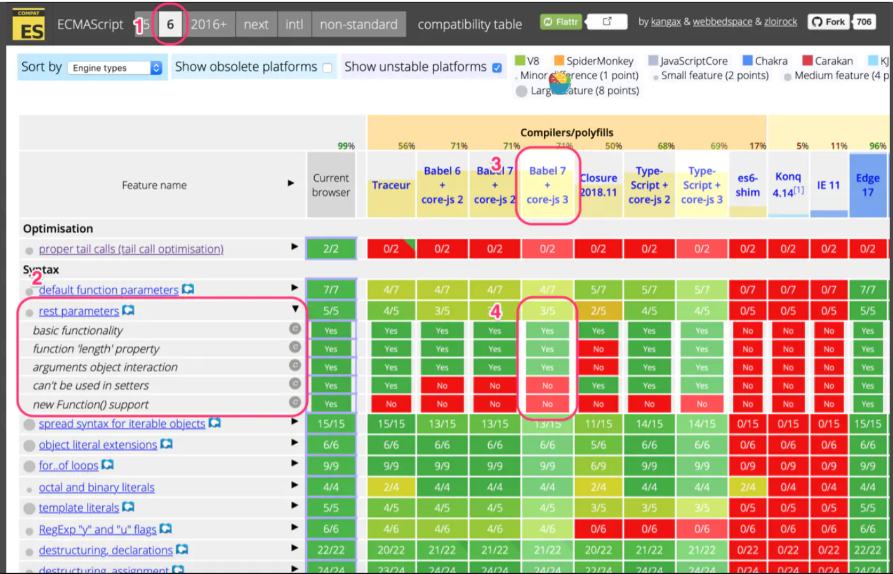

# TC39、ECMA-262、ECMAScript 的一些事儿

你们会不会有这样的情况，就是对于某项技术、语言到底在哪可以了解到最新的规范？而这些规范又是否被支持？支持到什么程度？完全没有头绪。

对于JavaScript,自从 ES6 规范发布以来，带来很多新的特性，而我们在消化这些大量的知识时，ES 规范也在不停的调整和增加内容。可是我们没有一个特定的流程和渠道来获取最新的资讯，这反而会越来越落后于前沿技术。

所以，下边我就针对JavaScript做了一份相关的知识的总结:
<!-- TOC -->

- [TC39、ECMA-262、ECMAScript 的一些事儿](#tc39ecma-262ecmascript-的一些事儿)
  - [ECMA、TC39、ECMA-262、ISO/IEC 16262、ECMAScript、JavaScript之间是什么关系呢？](#ecmatc39ecma-262isoiec-16262ecmascriptjavascript之间是什么关系呢)
  - [ECMAScript 版本的发展历史（时间线）是怎么样的呢？](#ecmascript-版本的发展历史时间线是怎么样的呢)
  - [TC39规范制定新的流程是怎么样的呢？](#tc39规范制定新的流程是怎么样的呢)
    - [提示：考虑单个功能和阶段，而不是 ECMAScript 版本](#提示考虑单个功能和阶段而不是-ecmascript-版本)
  - [为什么 ES7（ES2016） 这一版这么小？](#为什么-es7es2016-这一版这么小)
  - [一般可以去哪里查看TC39标准的进程呢？](#一般可以去哪里查看tc39标准的进程呢)
  - [我们怎么在程序中应用这些新特性呢？](#我们怎么在程序中应用这些新特性呢)
  - [向后兼容原则](#向后兼容原则)
  - [ES 标准与浏览器实现差异](#es-标准与浏览器实现差异)
    - [新的 API 是在原有对象的拓展](#新的-api-是在原有对象的拓展)
    - [新的语法就比如 let ，是对功能的扩展。](#新的语法就比如-let-是对功能的扩展)
  - [在哪里查看 ECMAScript 特性在运行环境中的兼容性？](#在哪里查看-ecmascript-特性在运行环境中的兼容性)
  - [什么是 Babel？](#什么是-babel)
  - [怎么搭配 TC39 和 Babel 来使用最新特性？](#怎么搭配-tc39-和-babel-来使用最新特性)
  - [推荐](#推荐)
- [参考：](#参考)
- [社交信息 / Social Links:](#社交信息--social-links)
  - [(Welcome to pay attention, 欢迎关注)](#welcome-to-pay-attention-欢迎关注)

<!-- /TOC -->

按老规矩来哈，咱们还是通过提问回答的形式来为大家介绍知识。

## ECMA、TC39、ECMA-262、ISO/IEC 16262、ECMAScript、JavaScript之间是什么关系呢？

[ECMA](https://www.ecma-international.org/):   
是ECMA国际组织，全称是Ecma International （以前叫 ECMA - European Computer Manufacturers Association - 欧洲计算机制造商协会）是个行业标准组织，它所通过的标准都是 ECMA-nnn 这样进行编号。

[TC39](https://tc39.es/zh-Hans/):   
是ECMA 国际组织第 39 号技术委员会（ Technical Committee ），它是一个推动 JavaScript 发展的委员会。它是 ECMA 的一部分， ECMA 是 “ ECMAScript ” 规范下的 JavaScript 语言标准化的机构。

TC39 由各个主流浏览器厂商的代表构成，当然国内一些大型的科技公司比如阿里和字节都已经加入了 TC39 。他们的主要工作就是制定 ECMAScript 标准，标准生成的流程，并实现。

> 每两个月，TC39 都会召开会议，成员指定的代表和受邀的专家参加。 这些会议的记录在 [GitHub 存储库](https://github.com/tc39/notes) 中公开。

除 TC39 外， ECMA 国际组织还有有众多其他的技术委员会，比如 TC43 Universal 3D (U3D)、TC45 Office Open XML Formats 等等。具体可以参考下[Ecma template for minutes – Ecma International](https://www.ecma-international.org/wp-content/uploads/Ecma-memento-2010-public.pdf)


> 通过上边介绍，我们就知道了ECMA 与 TC39之间的关系啦，以及可以推断出ECMA-262是又ECMA指定出来的一个标准。

然后下边说下JavaScript 语言的标准化：（涉及到ECMA-262 和 ISO/IEC 16262）

最初 JavaScript 语言有 2 份标准：

- ECMA-262：  
是主标准，由 ECMA 国际组织（Ecma International）负责管理（为了让最初的JavaScript 与最初的 JScript 能遵循同一套标准发展而诞生的 ECMAScript ，正好排到了作为 Ecma 的 262 号标准，所以得到 ECMA-262 编号。） 

- ISO/IEC 16262：
是第二标准，由国际标准化组织（ISO，International Organization for Standardization）和国际电子技术委员会（IEC，International Electrotechnical Commission）负责管理

出于商标版权的原因，规范标准中将这门语言称为 ECMAScript，所以原则上 JavaScript 与 ECMAScript 指的是同一个东西，但有时也会加以区分：

- JavaScript：指语言及其实现

- ECMAScript：指语言标准及语言版本，比如 ES6 表示语言（标准）的第 6 版


## ECMAScript 版本的发展历史（时间线）是怎么样的呢？

这是 ECMAScript 版本发展的简要时间线：

- ECMAScript 1（1997 年 6 月）：标准的第一个版本
- ECMAScript 2（1998 年 6 月）：使 ECMA-262 与 ISO 标准保持同步的小更新
- ECMAScript 3（1999 年 12 月）：增加了正则表达式、字符串处理、控制语句（do-while、switch）、异常处理（try-catch）等众多核心特性
- ECMAScript 4（2008 年 7 月废除)：本来是一次大规模升级（静态类型、模块、命名空间等），但跨度过大，出现了分歧，最终没能推广使用
- ECMAScript 5（2009 年 12 月）：一些小的改进，加入一些标准库特性和严格模式
- ECMAScript 5.1（2011 年 6 月）：小更新，使 Ecma 和 ISO 标准保持同步
- ECMAScript 6（2015 年 6 月）：一次大更新，实现了 ECMAScript 4 的许多设想。从这个版本开始按年份命名规范版本 - ECMAScript 2015
- ECMAScript 2016（2016 年 6 月）：第一个年度版本，与 ES6 相比，发布周期较短，新特性也相对少些
- ECMAScript 2017（2017 年 6 月）：第二个年度版本
> 后续的 ECMAScript 版本（ES2018 等）总是在 6 月获得批准生效。

> 额外说一句，还没有正式发布的规范也就是还在定制阶段的特性都被称为 ESNext。


## TC39规范制定新的流程是怎么样的呢？

咦...,为啥使行的流程呢？难道之前有其他的流程吗? 

是的，之前还真有，但是之前的流程有两个不太好的地方，所以被废除掉了。

是什么问题呢？我们来看看：

了解上边的版本发布时间线，我们知道， 在 ES3 出来之后，他们花了十年时间，几乎没有任何改变，使其达到规范。之后， ES6 又花了四年才能实现。发版周期过长存在 2 个问题：

1. 版本之间的时间跨度太长，提早定稿的特性要等待非常长的时间，一直等到规范正式发布（才能被实现和使用），而靠后的特性往往赶在最后发版期限之前才定稿，存在风险
2. 语言特性的设计与实现和使用相隔太久，在实现和使用阶段才发现设计缺陷为时已晚

**针对这些问题，TC39 制定了新的 TC39 流程（[The TC39 Process](https://tc39.es/process-document/)）：**

- ECMAScript 功能是独立设计的，并经历了从 0（“稻草人”）开始到 4（“完成”）结束的阶段。
- 尤其是后期阶段需要原型实现和实际测试，从而使得功能在设计和实现之间有反馈环节。
- ECMAScript 版本每年发布一次，包括在发布截止日期之前已达到第 4 阶段的所有功能。

> 采用新的TC39的流程，使得每次发布的版本是较小的增量版本，并且功能都是已经过现场测试。

具体的 TC39 流程图如下：

每个 ECMAScript 功能提案都经历从 0 到 4 编号的阶段。 [Test 262](https://github.com/tc39/test262) 是一套测试，用于检查 JavaScript 引擎是否符合语言规范。
  
- stage0 strawman：任何讨论、想法、改变或者还没加到提案的特性都在这个阶段。只有TC39成员可以提交。
- stage1 proposal:
  - （1）产出一个正式的提案。
  - （2）发现潜在的问题，例如与其他特性的关系，实现难题。
  - （3）提案包括详细的API描述，使用例子，以及关于相关的语义和算法。
- stage2 draft: 
  - （1）提供一个初始的草案规范，与最终标准中包含的特性不会有太大差别。草案之后，原则上只接受增量修改。
  - （2）开始实验如何实现，实现形式包括polyfill, 实现引擎（提供草案执行本地支持），或者编译转换（例如babel）
- stage3 candidate: 
  - （1）候选阶段，获得具体实现和用户的反馈。此后，只有在实现和使用过程中出现了重大问题才会修改。
  - （2）规范文档必须是完整的，评审人和ECMAScript的编辑要在规范上签字。
  - （3）至少要在一个浏览器中实现，提供polyfill或者babel插件。
- stage4 finished: 
  - （1）已经准备就绪，该特性会出现在下个版本的ECMAScript规范之中。
  - （2）需要通过有2个独立的实现并通过验收测试，以获取使用过程中的重要实践经验。


> 新流程使用 HTML 的超集来格式化提案，使用 GitHub pull requests 的模式来增加社区参与度

> 从 ES2016 开始（新 TC39 流程施行以来）， ES 版本的概念被大大弱化了，需要关心的是特性提案处于第几阶段，只要进入第 4 阶段就已经算是标准特性了

### 提示：考虑单个功能和阶段，而不是 ECMAScript 版本
直到 ES6 并包括 ES6，最常见的是从 ECMAScript 版本的角度考虑 JavaScript —— 例如，“这个浏览器支持 ES6 吗？”

从 ES2016(即是ES7) 开始，是从考虑单个功能出发：一旦某个功能达到第 4 阶段，您就可以安全地使用它（如果您所针对的 JavaScript 引擎支持它）。 您不必等到下一个 ECMAScript 版本。

## 为什么 ES7（ES2016） 这一版这么小？
特性提议随时可以提，多线并行审核推进，但**发版周期是固定**的：

- 2月1日：产出候选草案（Candidate Draft）
- 2-3月：60天的修订筛选期（royalty-free opt-out period）
- 3月TC39会议：合入stage 4（过审的）提议，校准最终语义，并从主分支迁出新规范版本，之后只接受编辑更改
- 4-6月：ECMA CC与ECMA GA审核期
- 7月：由ECMA大会（ECMA General Assembly）批准新标准

每年7月发版，把新过审的特性提议带上去，所以一个版本包含的新特性数量取决于这一年有多少特性过审了

这样一方面能够保证规范发布的特性都经过广泛审核确认了，另一方面保持每年一版的频繁节奏，避免再出现ES2015那样的大版本（6年憋一版）

## 一般可以去哪里查看TC39标准的进程呢？
- 废弃的提案：https://github.com/tc39/proposals/blob/master/inactive-proposals.md

- stage0: https://github.com/tc39/proposals/blob/master/stage-0-proposals.md

- stage1～3: https://github.com/tc39/proposals

- stage4 并包含进草案: https://github.com/tc39/proposals/blob/master/finished-proposals.md

> 此外，[TC39](https://github.com/tc39) 拥有很多仓库,其中的 [ecma262](https://github.com/tc39/ecma262#ecmascript) 仓库主要维护 ECMAScript 规范文档

## 我们怎么在程序中应用这些新特性呢？
babel的插件：  
- babel-presets-stage-0   
- babel-presets-stage-1   
- babel-presets-stage-2   
- babel-presets-stage-3   
- babel-presets-stage-4  

## 向后兼容原则
我们发现 ES 规范每一版始终完全兼容先前的所有特性，比如 ES6 提出了let、const但并没有干掉var，这是因为如果推出了不兼容的新版本，会造成一些问题：

1. JavaScript 引擎、IDE、构建工具都会变得臃肿，因为要支持新旧两版规范

2. 开发者需要了解并不断意识到版本之间的差异

3. 要么把现有的代码全都迁移到新版本，要么（不同项目）混用多个版本，重构会变得很麻烦

4. 甚至要标注每段代码的所属版本，就像 ES5 手动开启严格模式一样，当时没有流行起来的一个原因是在文件或函数开头添加指令也很麻烦

为了避免这些问题，ES6 采用了一种策略叫**One JavaScript**：

1. 新版本始终完全向后兼容（但偶尔可能会有轻微、不明显的清理）

2. 旧特性不删除也不修复，而是引入更好的版本，比如let就是var的改进版

3. 如果语言的某些方面有变化，只在新的语法结构内生效，即隐式选用，例如，yield只在generator中才是关键字、模块和类中的所有代码都默认开启严格模式

## ES 标准与浏览器实现差异
特性的演变迅速也让 JavaScript 开发者遇到了问题，新的特性可以使得编写出更高效健壮的代码，但我们我们的网站却要在未支持提供这些新特性的旧版浏览器上运行。在功能特性快速进化的环境下这个问题更加严峻。

举个例子：  


上图中绿色的部分就是 ECMAScript 特性和浏览器支持的特性的差异部分，这个差异可以分成两大部分：新的 API和新的语法。

### 新的 API 是在原有对象的拓展

比如 Array.includes 就是对数组对象的拓展。**它通常是解决一些历史遗留问题或者对常用代码逻辑的封装。**

举例来说，Object.is() 是一个用于检查两个值是否严格相等的新接口。=== 在处理 NaN 和 -0 这样的值时会有微妙的歧义，而 Object.is() 就是用来解决这样问题的。

```
NaN === NaN; // false
Object.is(NaN, NaN) // true
```

对于 API 的扩展带来的规范特性和浏览器特性的差异，通常都有一个被称为 polyfill 或者 [shim](https://github.com/es-shims) 的模式来抹平。这两个词的意思分别是 腻子 和 垫片，从词义上来说已经能很形象的描述它们的作用。

而 polyfill 可以使用 ES5 的代码来实现这些新 API，就以 Object.is() 来说就可以用以下代码来实现：
```
if (!Object.is) {
  Object.is = function(x, y) {
    // SameValue algorithm
    if (x === y) { // Steps 1-5, 7-10
      // Steps 6.b-6.e: +0 != -0
      return x !== 0 || 1 / x === 1 / y;
    } else {
      // Step 6.a: NaN == NaN
      return x !== x && y !== y;
    }
  };
}
```

### 新的语法就比如 let ，是对功能的扩展。

想要在旧浏览器中使用不支持的语法就必须要使用「转换+编译」的技术，利用专门的工具把代码转化为等价（或近似）的可以在 ES5 环境下工作的代码。


## 在哪里查看 ECMAScript 特性在运行环境中的兼容性？
这里提供一个[网站](http://kangax.github.io/compat-table/es6/)，专门查看兼容性表格。包含浏览器、手机端和服务器端。



简单介绍一下就是，在 某版本[1] 下的 某项特性[2] 在 某编译器或浏览器[3] 中的 兼容程度[4]。


## 什么是 Babel？
Babel 是一个 JavaScript 编译工具，专门用来编译 ECMAScript 6+ 的代码让其兼容就浏览器或运行环境。它可以转换语法、补充 API。
[参考](https://juejin.cn/post/6844903757608665096#heading-9)

## 怎么搭配 TC39 和 Babel 来使用最新特性？

如果你在别人的代码里或者网络上发现一个你没见过的 JS 代码语法你应该怎么办呢？

首先你应该尝试通过搜索引擎找到这种语法的正式名称。

然后你就可以去 TC39 的 github 中找一下，你可以在 ecma-262 正式文档中找（不过这个文档太长了）也可以在 proposals 列表里找一下，别遗漏了 finished proposals 和 inactive proposales 列表，最终你就会找到这个语法的介绍和用例。

接着你会想看一下这个语法在不同环境下的支持程度，所以你需要打开兼容性表格查询页面查找这个语法。

接着你也许会想尝试着编写一个用例并运行一下，那你需要在 Babel 的官网里查一下 plugins 列表里是否支持该语法，如果是新的 API 那就需要在 core-js 列表里找一下。

接着你就可以配置好 Babel 并编写用例，编译成浏览器兼容的代码，在浏览器里运行了。


## 推荐
[JavaScript 中文兴趣组](https://jscig.github.io/#)致力于提供一个加强中国 JavaScript 社区对 JavaScript 语言标准（ECMAScript）工作的参与的平台

> JSCIG 主要侧重于确定中国 JavaScript 开发者的需求、帮助 Ecma 的中国成员熟悉 TC39 标准流程、讨论可能提交给 TC39 的提案、标准的测试、实现以及和 JavaScript 相关的标准化机会，同时协助中国 JavaScript 社区对 JavaScript 语言的发展进行参与和贡献。

# 参考：
- [History and evolution of JavaScript](https://exploringjs.com/impatient-js/ch_history.html#how-javascript-was-created)
- [The TC39 Process](https://tc39.es/process-document/)
- [精读《TC39, ECMAScript, and the Future of JavaScript》](https://github.com/ascoders/weekly/issues/21)
- [2019 年的 JavaScript 新特性学习指南 | 掘金年度征文](https://juejin.cn/post/6844903757608665096)
- [D2前端技术论坛: 揭秘TC39: ES2020 和 ES2021](https://juejin.cn/post/6908329539525410830)
- [The Real Story Behind ECMAScript 4](https://auth0.com/blog/the-real-story-behind-es4/)
- [Babel 支持的语法插件列表](https://babeljs.io/docs/en/plugins)
- [Babel polyfill 中支持的 API 列表](https://github.com/zloirock/core-js)
- [在线学习 JS 的网站作者挺牛的](https://exploringjs.com/)
- [ES 新闻订阅](http://esnextnews.com/)


# 社交信息 / Social Links:
 ## (Welcome to pay attention, 欢迎关注)
Github：
[@huangyangquang](https://github.com/huangyangquang) | [最新技术追踪](https://github.com/huangyangquang/Latest-technology-tracking) | [javascript版算法](https://github.com/huangyangquang/Algorithm) | [早期前端知识总结 + 案例](https://github.com/huangyangquang/DEMO) | 欢迎Star✨✨✨


Social：
[新浪微博](https://weibo.com/u/6385661354) | [知乎](https://www.zhihu.com/people/cclv3) | [掘金](https://juejin.cn/user/2735240661699181) | [思否](https://segmentfault.com/u/c_z7wgq/articles) 

E-mail： fengquan.h@qq.com  

Old Blog：[CSDN](https://blog.csdn.net/huangyangquan3?type=blog)

微信公众号：前端学长Joshua  


 