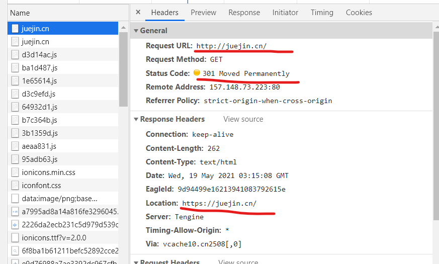
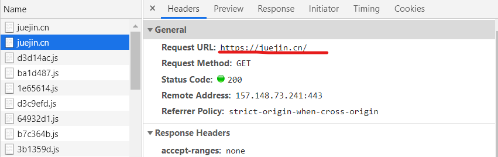
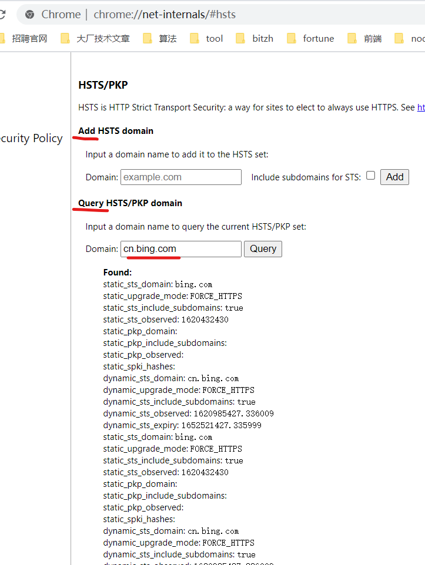
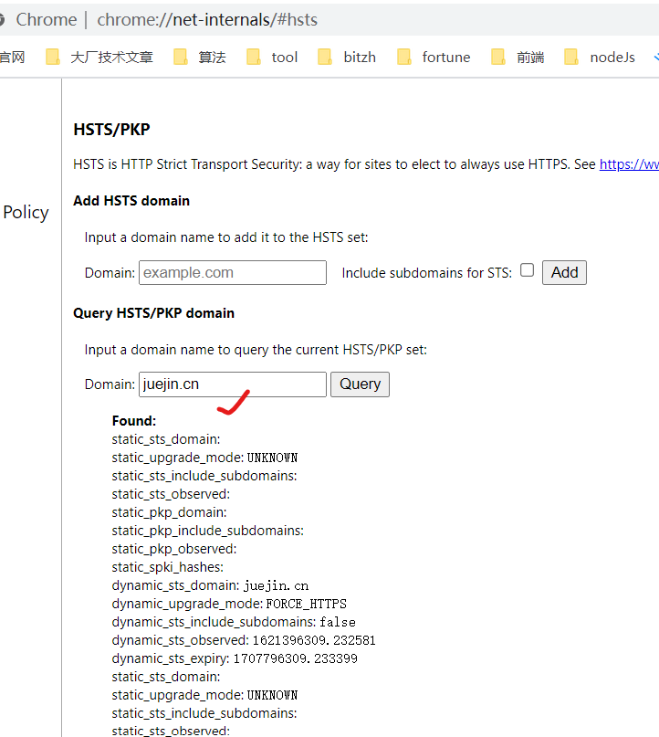
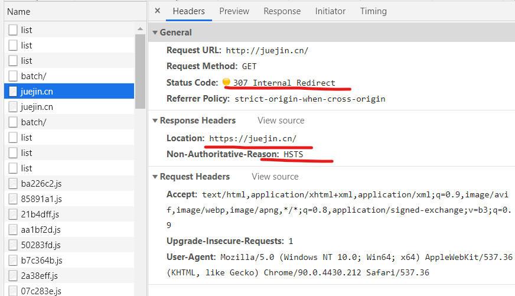

<!-- TOC -->

- [关于chrome浏览器(下面简称chrome)：](#关于chrome浏览器下面简称chrome)
    - [场景：在chrome地址栏上输入网址(eg: example.com, baidu.com...)   浏览器为什么会 为某些网址是自动补充网络协议http,为有些网址自动补充网络协议https呢？](#场景在chrome地址栏上输入网址eg-examplecom-baiducom---浏览器为什么会-为某些网址是自动补充网络协议http为有些网址自动补充网络协议https呢)
    - [场景：我们在chrome上输入 example.com 时，浏览器会默认帮我们补充为 http://example.com， 当我们回车去访问 http://example.com， 服务器会为返回一个301/302的状态码，将网站重定向至 https://example.com。在上述的过程中，黑客利用哪部分的漏洞进行攻击呢？](#场景我们在chrome上输入-examplecom-时浏览器会默认帮我们补充为-httpexamplecom-当我们回车去访问-httpexamplecom-服务器会为返回一个301302的状态码将网站重定向至-httpsexamplecom在上述的过程中黑客利用哪部分的漏洞进行攻击呢)
    - [为什么会要HSTS呢？](#为什么会要hsts呢)
    - [什么是HSTS?](#什么是hsts)
    - [HSTS的功能含义？](#hsts的功能含义)
    - [怎么判断站点是不是支持了HSTS?](#怎么判断站点是不是支持了hsts)
    - [HSTS字段的值是怎么定义的呢？这些key-value有什么含义呢？](#hsts字段的值是怎么定义的呢这些key-value有什么含义呢)
    - [关于预加载 HSTS](#关于预加载-hsts)
    - [用户首次访问某网站是不受HSTS保护，那么有什么方式可以弥补这个漏洞呢？](#用户首次访问某网站是不受hsts保护那么有什么方式可以弥补这个漏洞呢)
    - [浏览器预置HSTS域名列表在哪里查看呢？怎么把网站添加到浏览器预置HSTS域名列表中呢？](#浏览器预置hsts域名列表在哪里查看呢怎么把网站添加到浏览器预置hsts域名列表中呢)
- [参考：](#参考)
- [社交信息 / Social Links:](#社交信息--social-links)
  - [(Welcome to pay attention, 欢迎关注)](#welcome-to-pay-attention-欢迎关注)

<!-- /TOC -->
# 关于chrome浏览器(下面简称chrome)：

### 场景：在chrome地址栏上输入网址(eg: example.com, baidu.com...)   浏览器为什么会 为某些网址是自动补充网络协议http,为有些网址自动补充网络协议https呢？

答：

### 场景：我们在chrome上输入 example.com 时，浏览器会默认帮我们补充为 http://example.com， 当我们回车去访问 http://example.com， 服务器会为返回一个301/302的状态码，将网站重定向至 https://example.com。在上述的过程中，黑客利用哪部分的漏洞进行攻击呢？
### 为什么会要HSTS呢？

答: 
> 有的网站开启了https，但为了照顾用户的使用体验（因为用户总是很赖的，一般不会主动键入https，而是直接输入域名。 用户直接输入域名访问，默认就是http访问）. 当用户通过http访问的时候，服务器就会返回给用户一个302/301重定向，重定向到https的地址，然后后续的访问都使用https传输,这种通信模式看起来貌似没有问题，但细致分析，就会发现种通信模式也存在一个风险，那就是这个**302/301重定向可能会被劫持篡改**，如果被改成一个恶意的或者钓鱼的https站点，然后黑客就可以获取操作用户数据了。网站通过HTTP Strict Transport Security通知浏览器，这个网站禁止使用HTTP方式加载，**浏览器应该自动把所有尝试使用HTTP的请求自动替换为HTTPS请求。**

> HSTS可以用来抵御SSL剥离攻击。SSL剥离攻击是中间人攻击的一种，由Moxie Marlinspike于2009年发明。他在当年的黑帽大会上发表的题为“New Tricks For Defeating SSL In Practice”的演讲中将这种攻击方式公开。**SSL剥离的实施方法是阻止浏览器与服务器创建HTTPS连接**。它的前提是用户很少直接在地址栏输入https://，用户总是通过点击链接或3xx重定向，从HTTP页面进入HTTPS页面。所以攻击者可以在用户访问HTTP页面时替换所有https://开头的链接为http://，达到阻止HTTPS的目的。

> HSTS可以很大程度上解决SSL剥离攻击，因为只要浏览器曾经与服务器创建过一次安全连接，之后浏览器会强制使用HTTPS，即使链接被换成了HTTP.  
另外，如果**中间人使用自己的自签名证书来进行攻击，浏览器会给出警告**，但是许多用户会忽略警告。HSTS解决了这一问题，一旦服务器发送了HSTS字段，用户将不再允许忽略警告。

如下例子：掘金网站(要先清空缓存)：  

### 什么是HSTS?
   
答： 

> HTTP Strict Transport Security (通常简称为HSTS) 是一个安全功能，它告诉浏览器只能通过HTTPS访问当前资源, 禁止HTTP方式。
   

### HSTS的功能含义？

答：

> 对于篡改302的攻击，建议服务器开启HTTP Strict Transport Security功能，这个功能的含义是：
当用户已经安全的登录开启过htst功能的网站 (支持hsts功能的站点会在响应头中插入：Strict-Transport-Security) 之后，支持htst的浏览器(比如chrome. firefox)会自动将这个域名加入到**HSTS列表**，下次即使用户使用http访问这个网站，支持htst功能的浏览器就会自动发送https请求（前提是用户没有清空缓存，如果清空了缓存第一次访问还是明文，后续浏览器接收到服务器响应头中的Strict-Transport-Security，就会把域名加入到hsts缓存中，然后才会在发送请求前将http内部转换成https），而不是先发送http，然后重定向到https，这样就能避免中途的302重定向URL被篡改。进一步提高通信的安全性。

如下例子（暂时没有找到一个好的例子）：  

### 怎么判断站点是不是支持了HSTS?

答：  
响应头中插入了：Strict-Transport-Security  
浏览器在收到带有Strict-Transport-Security响应头的报文后，就会将这个站点加入到hsts缓存中，下次以http访问的时候就会被自动转换成https。

### HSTS字段的值是怎么定义的呢？这些key-value有什么含义呢？
   
答：
> 语法:  
> Strict-Transport-Security: max-age=<expire-time>  
> Strict-Transport-Security: max-age=<expire-time>; includeSubDomains  
> Strict-Transport-Security: max-age=<expire-time>; preload  

> 指令:  
> max-age=<expire-time>:  
    设置在浏览器收到这个请求后的<expire-time>秒的时间内凡是访问这个域名下的请求都使用HTTPS请求。  
includeSubDomains | 可选:  
    如果这个可选的参数被指定，那么说明此规则也适用于该网站的所有子域名。  
preload | 可选:  
    查看 预加载 HSTS 获得详情。不是标准的一部分。 

例子：
比如，https://example.com/ 的响应头含有Strict-Transport-Security: max-age=31536000; includeSubDomains。这意味着两点：  
1. 在接下来的一年（即31536000秒）中，浏览器只要向example.com或其子域名发送HTTP请求时，必须采用HTTPS来发起连接。比如，用户点击超链接或在地址栏输入 http://www.example.com/ ，浏览器应当自动将 http 转写成 https，然后直接向 https://www.example.com/ 发送请求。  
2. 在接下来的一年中，如果 example.com 服务器发送的TLS证书无效，用户不能忽略浏览器警告继续访问网站。  

### 关于预加载 HSTS
> 谷歌维护着一个 HSTS 预加载服务 https://hstspreload.org/。 按照如下指示成功提交你的域名后，浏览器将会永不使用非安全的方式连接到你的域名。虽然该服务是由谷歌提供的，但所有浏览器都有使用这份列表的意向（或者已经在用了）。但是，这不是 HSTS 标准的一部分，也不该被当作正式的内容。

> Chrome & Chromium 的 HSTS 预加载列表： https://www.chromium.org/hsts  
> Firefox 的 HSTS 预加载列表：nsSTSPreloadList.inc

### 用户首次访问某网站是不受HSTS保护，那么有什么方式可以弥补这个漏洞呢？

答：
> 用户首次访问某网站是不受HSTS保护的。这是因为首次访问时，浏览器还未收到HSTS，所以仍有可能通过明文HTTP来访问。解决这个不足目前有两种方案:  
一是浏览器预置HSTS域名列表，Google Chrome、Firefox、Internet Explorer和Spartan实现了这一方案。  
二是将HSTS信息加入到域名系统记录中。但这需要保证DNS的安全性，也就是需要部署域名系统安全扩展。截至2014年这一方案没有大规模部署。

> 由于HSTS会在一定时间后失效（有效期由max-age指定），所以浏览器是否强制HSTS策略取决于当前系统时间。部分操作系统经常通过网络时间协议更新系统时间，如Ubuntu每次连接网络时，OS X Lion每隔9分钟会自动连接时间服务器。攻击者可以通过伪造NTP信息，设置错误时间来绕过HSTS。解决方法是认证NTP信息，或者禁止NTP大幅度增减时间。比如Windows 8每7天更新一次时间，并且要求每次NTP设置的时间与当前时间不得超过15小时

### 浏览器预置HSTS域名列表在哪里查看呢？怎么把网站添加到浏览器预置HSTS域名列表中呢？

答：  
访问：chrome://net-internals/#hsts

查看(www.baidu.com也是有的)：  

下面将掘金网址添加至我们浏览器的hsts列表中：  
  
不清除浏览器缓存，访问juejin.cn：  
  
可以看到，一个307 响应码，这是chrome浏览器的内部转换，将http转换成https后再发送请求。

备注：为什么我们要求在未清空chrome浏览器的缓存前访问呢？  
因为如果清空了chrome浏览器的缓存之后，我们手动加入到hsts缓存中的域名就会被清除，也就不会看到预期的效果了。

# 参考： 
- [HTTP Strict Transport Security(MDN)](https://developer.mozilla.org/zh-CN/docs/Web/HTTP/Headers/Strict-Transport-Security)
- [HTTP Strict Transport Security实战详解](https://www.cnblogs.com/sunsky303/p/8862600.html)

# 社交信息 / Social Links:
 ## (Welcome to pay attention, 欢迎关注)

Github：
    <a target="_blank" href="https://github.com/huangyangquang">@huangyangquang</a>

Social：
    <a target="_blank" href="https://weibo.com/u/6385661354">新浪微博</a> 
    | 
    <a target="_blank" href="https://www.zhihu.com/people/cclv3">知乎</a>
    | 
    <a target="_blank" href="https://juejin.cn/user/2735240661699181">掘金</a>
    | 
    <a target="_blank" href="https://segmentfault.com/u/c_z7wgq/articles">是否</a>

E-mail： 572518423@qq.com

Old Blog：
    <a target="_blank" href="https://blog.csdn.net/huangyangquan3?type=blog">CSDN</a>

    微信公众号：前端学长Joshua

