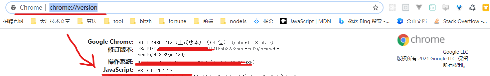
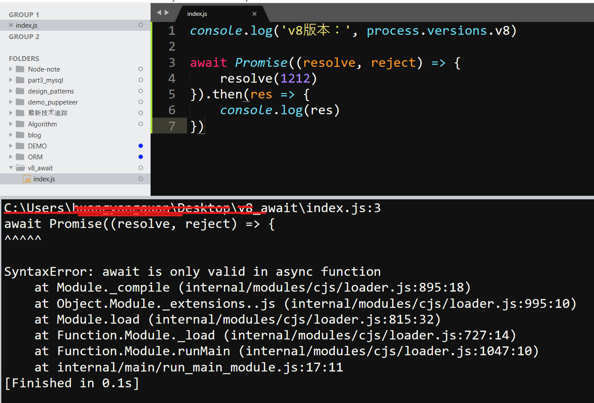
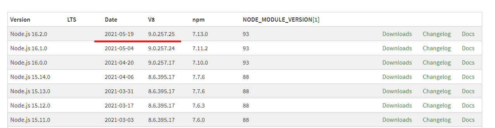

# Top-level await (v8 9.1正式支持顶级await)
<!-- TOC -->

- [Top-level await (v8 9.1正式支持顶级await)](#top-level-await-v8-91正式支持顶级await)
- [如何查看当前使用的v8版本是多少？（chrome / node环境）](#如何查看当前使用的v8版本是多少chrome--node环境)
- [v8 9.1之前使用顶层await会出现什么问题？](#v8-91之前使用顶层await会出现什么问题)
- [window下怎么修改node的版本，来升级v8的版本呢？](#window下怎么修改node的版本来升级v8的版本呢)
- [参考](#参考)
- [社交信息 / Social Links:](#社交信息--social-links)
  - [(Welcome to pay attention, 欢迎关注)](#welcome-to-pay-attention-欢迎关注)

<!-- /TOC -->

请先阅读原文：[Top-level await](https://v8.dev/features/top-level-await)  

其中，我最感兴趣的是：[Module execution order](https://v8.dev/features/top-level-await#module-execution-order)
  
使用顶级 await 对 JavaScript 的最大更改之一是图中模块的执行（就是代码的实际运行）顺序。JavaScript 引擎在后序遍历中执行模块：从模块图最左边的子树，开始评估模块，导出它们的绑定，他们的兄弟姐妹被执行，其次是他们的父母。该算法递归运行，直到它执行模块图的根。 
 
在顶级 await 之前，此顺序始终是同步且确定的：在多次运行您的代码之间，您的模块图保证以相同的顺序执行。  

一旦顶级await被正式支持，同样的保证也是存在的，但前提是你不使用顶级 await。 

以下是在模块中使用顶级 await 时发生的情况：  
1. 当前模块的执行被推迟，直到Promise被resolved。
2. 父模块的执行被推迟到调用 await 的子模块及其所有兄弟模块导出(export)绑定。
3. 兄弟模块和父模块的兄弟模块能够以相同的同步顺序继续执行 —— 假设模块图中没有循环或其他等待的承诺。
4. 调用 await 的模块在等待Promise被resolves后恢复执行。
5. 只要没有其他等待的Promise，父模块和后续树就会继续以同步顺序执行。

# 如何查看当前使用的v8版本是多少？（chrome / node环境）
chrome: 地址栏输入： 
> chrome://version/  

node: 命令行输入：
> node -p process.versions.v8
或者
> npm version  

# v8 9.1之前使用顶层await会出现什么问题？
报错：SyntaxError: await is only valid in async function  

# window下怎么修改node的版本，来升级v8的版本呢？
window下安装是比较麻烦的，如果是mac的话，可以通过 **n** 来进行版本控制管理.
> 命令行输入：where node  
> 直接去官网下载你想要的版本，安装在上述路径中覆盖即可  
> 命令行输入：node -v 发现node版本更新到你想要的版本  
> 命令行输入：node -p process.versions.v8 发现v8版本更新到你想要的版本  

另外window下可以使用node版本管理工具 —— [nodist](https://github.com/nullivex/nodist)

看了下node版本与v8版本的对应关系，目前还node上没有v8 9.1的： 

# 参考
- [V8 release v9.1](https://v8.dev/blog/v8-release-91)
- [Top-level await](https://v8.dev/features/top-level-await)
- [Node.js版本的表, node版本-v8版本-npm版本](https://nodejs.org/en/download/releases/)
- [如何检查NodeJS装有哪个版本的v8？](https://qastack.cn/programming/5356113/how-to-check-which-version-of-v8-is-installed-with-my-nodejs)
- [windows下升级nodejs](https://juejin.cn/post/6844903812172365837)
- [nvm安装与使用](https://www.cnblogs.com/gaozejie/p/10689742.html)
- [16 ECMAScript Language: Scripts and Modules](https://tc39.es/ecma262/#sec-ecmascript-language-scripts-and-modules)
  

  
# 社交信息 / Social Links:
 ## (Welcome to pay attention, 欢迎关注)
Github：
[@huangyangquang](https://github.com/huangyangquang) | [最新技术追踪](https://github.com/huangyangquang/Latest-technology-tracking) | [javascript版算法](https://github.com/huangyangquang/Algorithm) | [早期前端知识总结 + 案例](https://github.com/huangyangquang/DEMO) | 欢迎Star✨✨✨

Social：
[新浪微博](https://weibo.com/u/6385661354) | [知乎](https://www.zhihu.com/people/cclv3) | [掘金](https://juejin.cn/user/2735240661699181) | [思否](https://segmentfault.com/u/c_z7wgq/articles) 

E-mail： fengquan.h@qq.com  

Old Blog：[CSDN](https://blog.csdn.net/huangyangquan3?type=blog)

微信公众号：前端学长Joshua  

 